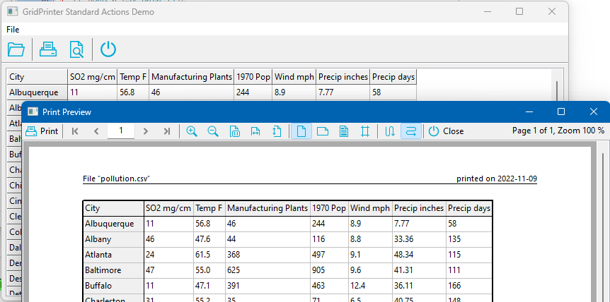

# GridPrinter

**TGridPrinter** is a component to simplify printing of string grids or other descendants of `TCustomGrid`. It is bundled together with a ready-made print preview dialog, **TGridPrintPreviewDialog**, as well as standard actions to trigger printing or to show the preview dialog without writing a single line of code.



**Author:** Werner Pamler  
**License:** Modified LGPL-2 (with linking exception, like Lazarus LCL).

---

## Download and Installation

### Release version
The package is made available for installation by the **Online-Package-Manager** (OPM). Additionally, a zip file with the most recent release version can be found at [Lazarus CCR at SourceForge](https://sourceforge.net/projects/lazarus-ccr/files/GridPrinter/). Unzip the file into any folder, load `gridprinterpkg.lpk` into Lazarus and click *Use* > *Install*.

### Development version
The current development version is hosted at [Lazarus CCR (SVN)](https://sourceforge.net/p/lazarus-ccr/svn/HEAD/tree/components/gridprinter/). Use SVN to check it out, or download the zipped snapshot from that page. Install by loading `gridprinterpkg.lpk` and clicking *Use* > *Install*.

---

## Getting Started

### How can I print a StringGrid?
1. Drop a `TGridPrinter` component on the form.
2. Link its `Grid` property to the StringGrid you want to print.
3. In the `OnClick` handler of a button or menu item, call the `Print` method.

```pascal
procedure TForm1.PrintButtonClick(Sender: TObject);
begin
  GridPrinter1.Print;
end;
```

### How can I see a preview before printing?
1. Drop a `TGridPrintPreviewDialog` on the form.
2. Link its `GridPrinter` property to the `TGridPrinter` instance.
3. Call the `Execute` method of the preview dialog.

```pascal
procedure TForm1.PrintPreviewButtonClick(Sender: TObject);
begin
  GridPrintPreviewDialog1.Execute;
end;
```

The preview dialog allows you to scroll pages, zoom, change orientation, adjust margins by dragging, and add headers/footers – and print from there as well.

### Selecting a printer
`TGridPrinter` has a property `ShowPrintDialog` which controls whether a print dialog is shown before printing. The possible values are:
- `gpdNone` – no dialog
- `gpdPageSetup` – shows `TPageSetupDialog` (paper size, orientation, margins)
- `gpdPrintDialog` – shows `TPrintDialog` (printer, copies, page range)
- `gpdPrinterSetup` – shows `TPrinterSetupDialog` (printer, paper size, orientation)

### Applying `OnPrepareCanvas` formatting to printout
Both the grid and the `TGridPrinter` fire an `OnPrepareCanvas` event. You can share the same event handler, but you must use the correct canvas depending on the sender.

```pascal
procedure TForm1.PrepareCanvasHandler(Sender: TObject; ACol, ARow: Integer; AState: TGridDrawState);
var
  lCanvas: TCanvas;
begin
  if Sender = StringGrid1 then
    lCanvas := StringGrid1.Canvas
  else if Sender = GridPrinter1 then
    lCanvas := GridPrinter1.Canvas
  else
    raise Exception.Create('Unknown sender of OnPrepareCanvas.');

  if ARow < StringGrid1.FixedRows then
    lCanvas.Font.Style := [fsBold];
end;
```

### Printing a DBGrid
Printing a `TDBGrid` requires extra work because the grid only holds a small portion of the dataset. You need to provide event handlers for `OnGetRowCount`, `OnBeforePrint`, `OnNewLine`, and `OnGetCellText`. See the example projects (`dbgrid2`) in the GridPrinter installation folder for details.

Example snippets:

```pascal
procedure TForm1.GridPrinter1GetRowCount(Sender: TObject; AGrid: TCustomGrid;
  var ARowCount: Integer);
var
  dbGrid: TDBGrid;
begin
  dbGrid := AGrid as TDBGrid;
  dbGrid.DataSource.DataSet.Last;
  dbGrid.DataSource.DataSet.First;
  ARowCount := dbGrid.DataSource.DataSet.RecordCount + 1;  // +1 for header row
end;

procedure TForm1.GridPrinter1BeforePrint(Sender: TObject);
begin
  DBGrid1.DataSource.DataSet.First;
end;

procedure TForm1.GridPrinter1NewLine(Sender: TObject; AGrid: TCustomGrid;
  ARow: Integer);
var
  dbGrid: TDBGrid;
begin
  dbGrid := AGrid as TDBGrid;
  BufDataset1.RecNo := ARow;  // RecNo starts at 1
end;

procedure TForm1.GridPrinter1GetCellText(Sender: TObject; AGrid: TCustomGrid;
  ACol, ARow: Integer; var AText: String);
var
  dbGrid: TDBGrid;
  col: TColumn;
  colOffs: Integer;
begin
  AText := '';
  dbGrid := AGrid as TDBGrid;
  if dgIndicator in dbGrid.Options then colOffs := 1 else colOffs := 0;
  if ACol < colOffs then Exit;
  col := dbGrid.Columns[ACol - colOffs];
  if ARow = 0 then AText := col.FieldName
  else AText := col.Field.AsString;
end;
```

### Printing a page number
Enable the header or footer, set its `Visible` property to `True`, and enter text with the `$PAGE` symbol (e.g., `'|$PAGE|'` for centered page number). Other symbols: `$PAGECOUNT`, `$DATE`, `$TIME`, `$FILENAME`, etc.

---

## Documentation

### TGridPrinter

#### Public methods
- `function CreatePreviewBitmap(APageNo, APercentage: Integer): TBitmap`
- `function GetCellText(ACol, ARow: Integer): String`
- `procedure Print` – main method
- `procedure ScaleToPages(NumHor, NumVert: Integer)`
- `function ScaleX(AValue: Integer): Integer`
- `function ScaleY(AValue: Integer): Integer`
- `procedure UpdatePreview`

#### Public properties (read-only)
- `Canvas: TCanvas`
- `ColCount: Integer`
- `ColWidth[AIndex: Integer]: Double`
- `FooterMargin: Integer`
- `HeaderMargin: Integer`
- `PageHeight, PageWidth: Integer`
- `PageRect: TRect`
- `PixelsPerInchX, PixelsPerInchY: Integer`
- `Padding: Integer`
- `PageCount: Integer`
- `PrintPageNumber: Integer`
- `PrintScaleToNumHorPages, PrintScaleToNumVertPages: Integer`
- `PrintScalingMode: TGridPrnScalingMode`
- `RowCount: Integer`
- `RowHeight[AIndex: Integer]: Double`

#### Published properties and events

**Properties**
- `Grid: TCustomGrid` – link to the grid to print.
- `BorderLineColor, BorderLineWidth`
- `FileName: String` – used in header/footer symbols.
- `FixedLineColor, FixedLineWidth`
- `Footer: TGridPrnHeaderFooter`
- `FromPage, ToPage: Integer`
- `GridLineColor, GridLineWidth`
- `Header: TGridPrnHeaderFooter`
- `Margins: TGridPrnMargins`
- `Monochrome: Boolean`
- `Options: TGridPrnOptions` – includes centering, grid lines, borders, etc.
- `Orientation: TPrinterOrientation`
- `PrintOrder: TGridPrnOrder` – rows first or columns first.
- `PrintScaleFactor: Double`
- `ShowPrintDialog: TGridPrnDialog`

**Events**
- `OnAfterPrint`, `OnBeforePrint`
- `OnGetCellText`, `OnGetRowCount`, `OnGetColCount`
- `OnLinePrinted`, `OnNewLine`, `OnNewPage`
- `OnPrepareCanvas`
- `OnPrintCell`
- `OnUpdatePreview`

##### TGridPrnHeaderFooter
Class for header/footer lines.

**Published properties**
- `Font: TFont`
- `LineColor, LineWidth`
- `SectionSeparator: String` (default '|')
- `ShowLine: Boolean`
- `Text: String` – supports symbols: `$DATE`, `$PAGECOUNT`, `$PAGE`, `$FULL_FILENAME`, `$FILENAME`, `$PATH`, `$TIME`
- `Visible: Boolean`

**Public properties**
- `ProcessedText[AIndex: TGridPrnHeaderFooterSection]: String`
- `SectionText[AIndex: TGridPrnHeaderFooterSection]: String`

##### TGridPrnMargins
Margin parameters (in millimeters):
- `Left, Top, Right, Bottom`
- `Header` – margin to top of header
- `Footer` – margin to bottom of footer

---

### TGridPrintPreviewDialog
(In unit `GridPrnPreviewDlg`)

#### Public methods
- `procedure Execute` – main method.

#### Published properties
- `FormParams: TGridPrintPreviewFormParams`
- `GridPrinter: TGridPrinter`
- `Options: TGridPrintPreviewOptions` – controls visibility of toolbar elements (navigation, zoom, orientation, margins, header/footer setup, print order, centering, scaling, page setup).
- `Zoom: Integer` – scaling factor in percent (default 100).
- `ZoomMode: TGridPrintPreviewZoomMode` – `zmCustom`, `zmFitWidth`, `zmFitHeight`.

##### TGridPrintPreviewFormParams
- `Left, Top, Width, Height: Integer`
- `Position: TPosition` – e.g., `poMainFormCenter`, `poScreenCenter`.

#### Preview form functionality
The preview dialog includes a toolbar with the following buttons (icons are taken from the Lazarus general-purpose image collection by Roland Hahn):

| Icon | Description |
|------|-------------|
|  | Sends the grid to the printer. |
|  | Displays the first page. |
|  | Displays the previous page. |
|  | Displays the next page. |
|  | Displays the last page. |
|  | Enlarges the preview. |
|  | Reduces the preview. |
|  | Original size (100%). |
|  | Scales to fill the width. |
|  | Scales to fill the height. |
|  | Switches to portrait orientation. |
|  | Switches to landscape orientation. |
|  | Opens dialog to set up header/footer. |
|  | Displays margins as draggable lines. |
|  | Prints rows first for large grids. |
|  | Prints columns first. |
|  | Centers grid horizontally. |
|  | Centers grid vertically. |
|  | Opens a dialog to set scale factor. |
|  | Dropdown menu with page setup options. |

---

### GridPrinter Actions
(Unit `GridPrnActions`)

#### TGridPrinterAction
When its `GridPrinter` property is linked to a `TGridPrinter` instance, and the action is assigned to a control’s `Action` property, clicking the control executes the `Print` method without any additional code.

#### TGridPrintPreviewAction
When its `PreviewDialog` property is linked to a `TGridPrintPreviewDialog` instance, clicking the control runs the `Execute` method of the preview dialog.

---

## Modifications

This version of GridPrinter has been modified from the original by Werner Pamler.

**Original:**  
- Author: Werner Pamler  
- License: Modified LGPL-2 (with linking exception, like Lazarus LCL)  
- Source: [GridPrinter on Free Pascal wiki](https://wiki.freepascal.org/GridPrinter)

**Modifications:**  
- Modified for use in **Notetask** application (© 2024 Alexander Tverskoy)  
- Enhancements:  
  - Enhanced tag printing support

These modifications are distributed under the same license as the original: **Modified LGPL-2** with linking exception.

--

*This README is based on the [GridPrinter wiki page](https://wiki.freepascal.org/GridPrinter) (last edited 14 December 2022).*